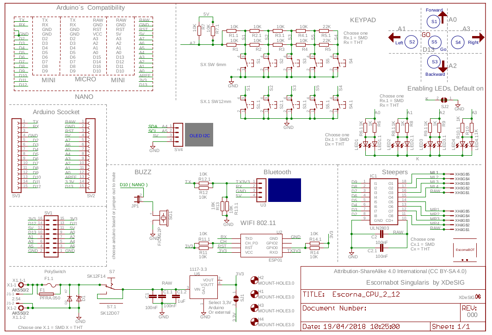
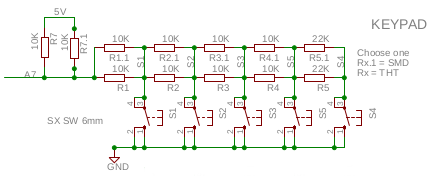
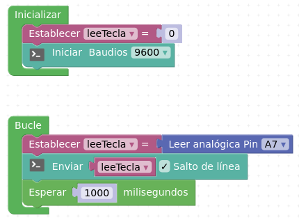
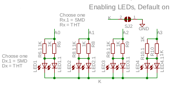
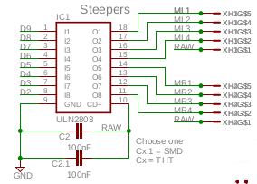
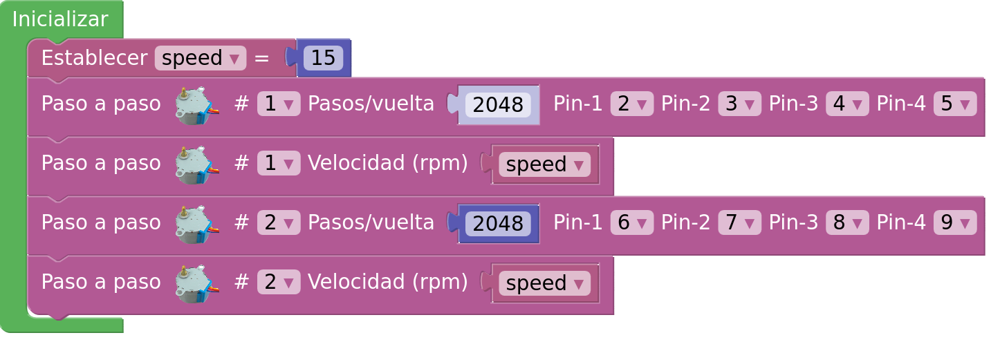
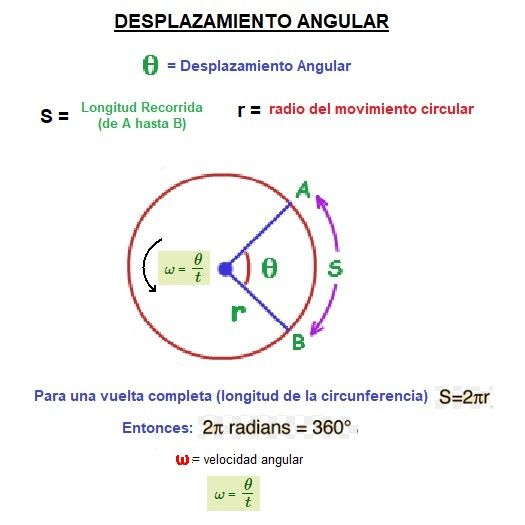

#**HARDWARE**

La placa de control del robot [Escornabot](https://escornabot.com) se denomina [EscornaCPU](https://github.com/escornabot/electronics/tree/master/EscornaCPU/2.x) y la última versión es la 2.x.

En el esquema de la [versión 2.12](https://github.com/escornabot/electronics/blob/master/EscornaCPU/2.x/2.12/Escorna_CPU_2_12_ESQ.pdf) se ve los diferentes bloques.

CPU v.2.12

## **Teclado**
El esquema correspondiente al bloque del teclado.

Teclado

Observando el esquema del teclado hay un cable etiquetado con **A7** que va al microcontrolador (entrada analógica).

El funcionamiento del teclado es un **divisor de tensión**, la pulsación de cada una de las teclas va a dar un valor de tensión en función del número de resistencias en serie que estén conectadas. El valor correspondiente a cada tecla se puede obtener, por medio del **monitor serie**, con el siguiente programa y se anotan para utilizar posteriormente el valor de cada tecla con el movimiento a realizar.

http://www.arduinoblocks.com/web/project/1617016

Programa valor teclado

## **LED**
Cada una de las teclas tiene asociado un LED que se conectan a los pines A0, A1, A2 y A3. Estos pines se utilizan como salidas digitales.

Esquema LED

El programa de test de los LED

http://www.arduinoblocks.com/web/project/1617023

## **Motores paso a paso**
Los motores del robot son tipo paso a paso y para el control de la secuencia de movimientos de los motores paso a pasos ([28byj-48](https://createc3d.com/es/comprar-electronica-impresora-3d/712-comprar-motor-de-paso-a-paso-5v-28byj-48-precio-oferta.html)) se utiliza 4 pines digitales para cada uno conectados a un driver [ULN2803](https://tienda.bricogeek.com/componentes/60-driver-darlington-8-canales-uln2803-dip.html) entre la placa Nano Arduino y los motores.

Pines de los motores paso a paso

Información sobre el funcionamiento de motores paso a paso en [programarfacil.com](https://programarfacil.com/blog/arduino-blog/motor-paso-a-paso-uln2003-l298n/).

[Información y práctica de programación de los bloques de Arduinoblocks](https://github.com/arduinoblocks/academy/blob/master/P19_motor_pasoapaso.pdf)

En [Arduinoblocks](http://www.arduinoblocks.com) existe unos bloques de programación con los que se pueden hacer un programa de prueba.
En el programa se indica la configuración de las conexiones en el **bloque inizialización**.

Configuración de las conexiones de los motores paso a paso

## **Desplazamiento lineal**
Antes de cargar el programa de **test motores paso a paso** se ha de tener en cuenta cómo calcular el [desplazamiento lineal](https://www.areaciencias.com/fisica/desplazamiento-angular) de cada paso que realiza el motor.

En el bloque de programación se tiene:

2048 pasos --> 1 vuelta --> 360º/2048 = 0,175 º/paso

El diámetro de la rueda del robot Escornabot es de 75mm --> radio = 37,5mm.

El desplazamiento lineal de cada paso

S = Θ (radianes) x r = (0,175·2·π)/360 x 37,5 = 0,114mm

Para calcular el número de paso de un desplazamiento lineal (D) en mm.

pasos = D/0,114

El programa de test para motores paso a paso

http://www.arduinoblocks.com/web/project/editor/1617035