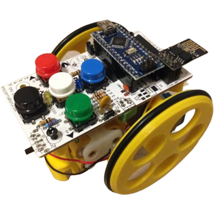

# **Introducción**

En construcción

Proyectos de programación del robot [Escornabot](https://escornabot.com).

El [Escornabot](https://escornabot.com)

Escornabot Singularis

El robot [Escornabot](https://escornabot.com) es un recurso educativo apropiado para desarrollar el Pensamiento Computacional en edades tempranas por su facilidad de programar sus movimientos y su utilización transversal en casi todos los contenidos educativos de aprendizaje.

En este proyecto se va a utilizar [Escornabot](https://escornabot.com) para aprender a programar el robot con un lenguaje de programación visual como es [Arduinoblocks](http://www.arduinoblocks.com).

Previamente se tiene que conocer el hardware del robot para desarrolar el programa de control en el microcontrolador del robot. Esta información se va a obtener de la web de [Escornabot](https://escornabot.com).
