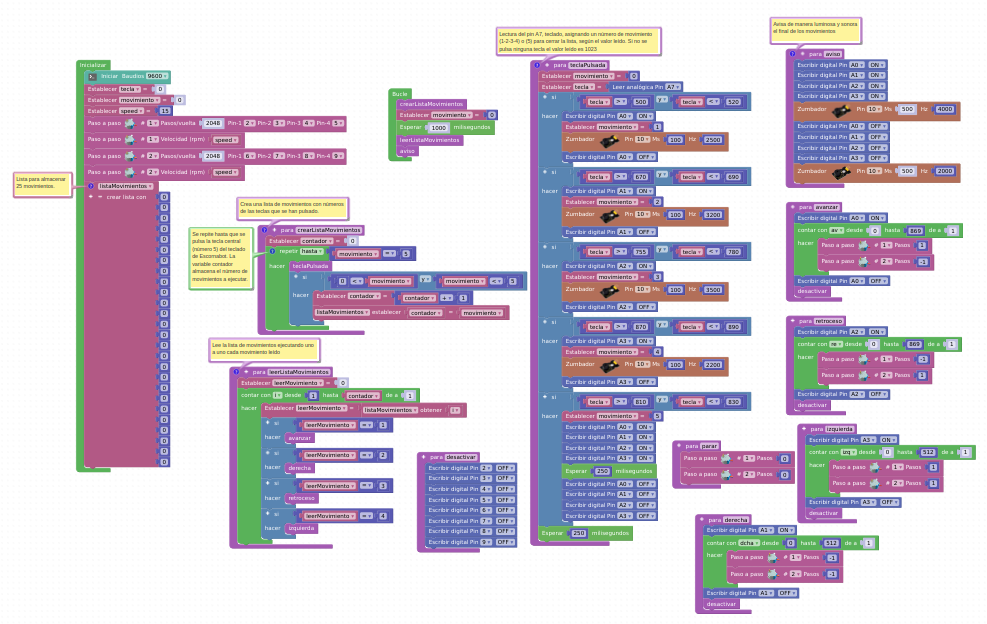
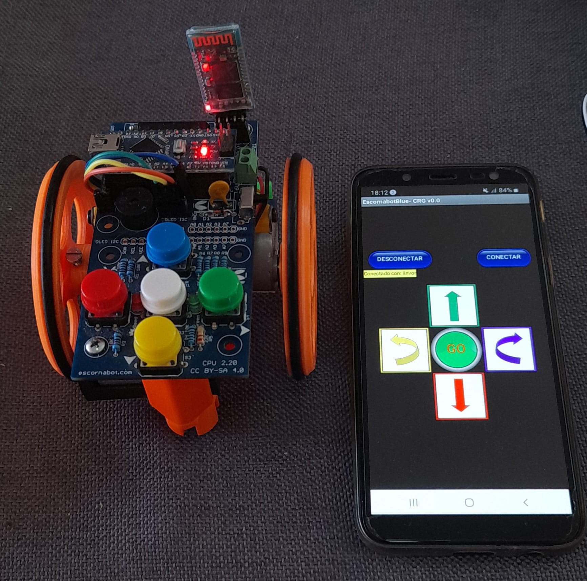

#**PROGRAMAS DE CONTROL**
En esta sección se encuentra diferentes programas de control del robot Escornabot programados con el lenguaje visual [Arduinoblock](http://www.arduinoblocks.com)

## **Programa de control con EEPROM**
Programa de control completo correspondiente al taller **"Programando ESCORNABOT con ARDUINOBLOCKS"** del [Club Robótica Granada](https://clubroboticagranada.github.io/taller_programacion_escornabot_arduinoblocks/), 20 febrero 2024.

http://www.arduinoblocks.com/web/project/editor/1599479

## **Programa de control mediante lista de datos**
En este link corresponde al primer programa de testeo para comprobar funcionamiento del robot Escornabot.

http://www.arduinoblocks.com/web/project/1217118

En este programa se utiliza como estructura de datos para memorizar los movimientos una lista.

Programa de control con lista

## **Programa de control por Bluetooth**

En construcción

Este programa controla el robot Escornabot por Bluetooth. SE ESTÁ TESTEANDO

http://www.arduinoblocks.com/web/project/editor/1619397

