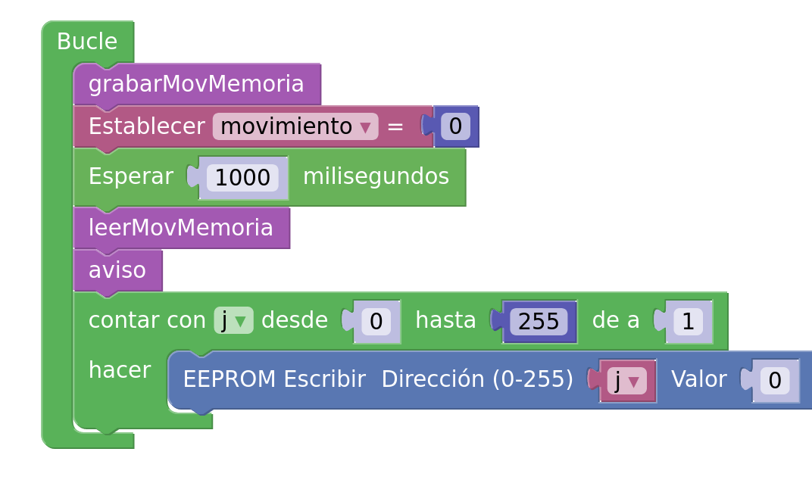
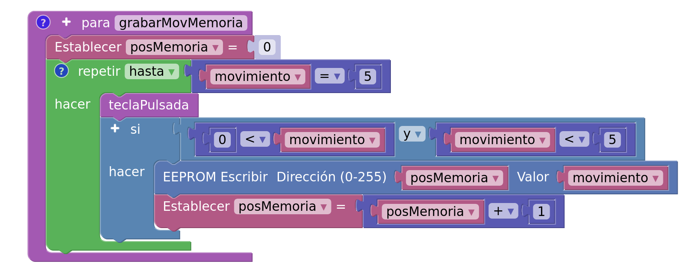
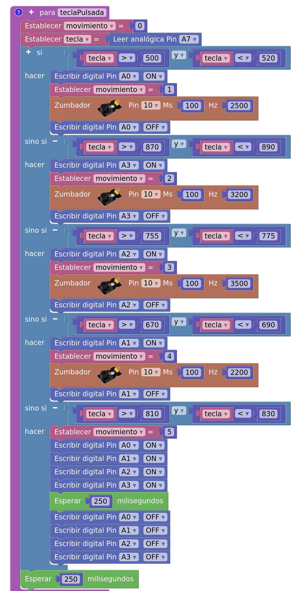
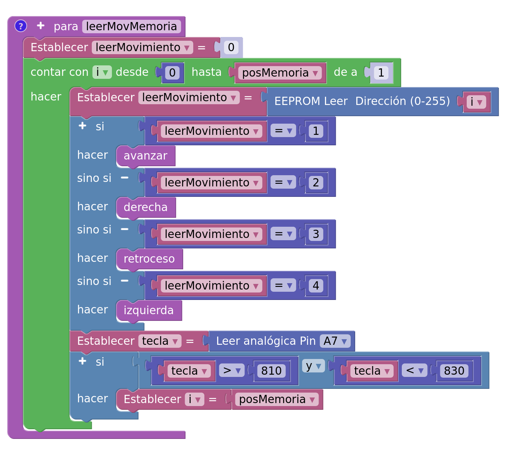
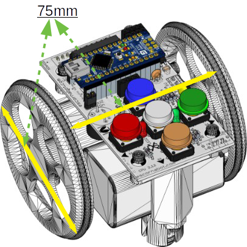

#**SOFTWARE**
El programa de control de robot Escornabot va a imitar lo más parecido posible al robot original.

El algoritmo a implementar en este proyecto tiene los siguientes elementos:

1. Declarar en el bloque **Inicializar**.
    * Variables.
    * Configuración de los motores paso a paso.
    * Inicializar la estructura de datos para memorizar los movimientos
    * ...
2. Declarar las funciones del programa.
    * **avanzar, retroceso, derecha, izquierda, parar**, funciones de movimientos.
    * **grabarMovMemoria**, grabar movimientos en memoria 
    * **teclaPulsada**, leer tecla pulsada.
    * **leerMovMemoria**, leer y ejecutar los movimientos grabados.
3. Código principal **Bucle**.

## **Grabar movimientos**
La función **grabarMovMemoria** llama a la función **teclaPulsada** para identificar el número del movimiento que graba en una posición de la memoria EEPROM. Esta acción se repite hasta que se pulsa el botón central que corresponde al número 5.

### **Leer botón pulsado (teclaPulsada)**

## **Ejecutar los movimientos (leerMovMemoria)**
Una vez grabados los movimientos que nos marca el reto con el robot Escornabot se pasa a leer los movimientos grabados en las posiciones de memoria EEPROM y cada lectura llama a la función de movimiento correspondiente.

Esta función tiene una acción complementaria que corresponde a la última instrucción condicional. La acción que hace es de interrumpir la secuencia de movimiento de manera voluntaria.

### **Funciones de movimiento**
Para implementar el código de las funciones de movimiento se necesita conocer las medidas del robot Escornabot.

Se hace los cálculos de los pasos para avanzar 10cm y girar 90º con lo visto en el apartado de **desplazamiento lineal** de la sección **Hardware**. Se implementa las funciones para realizar los movimientos y al mismo tiempo de encinde/apaga el LED correspondiente.

Funciones de Movimientos

