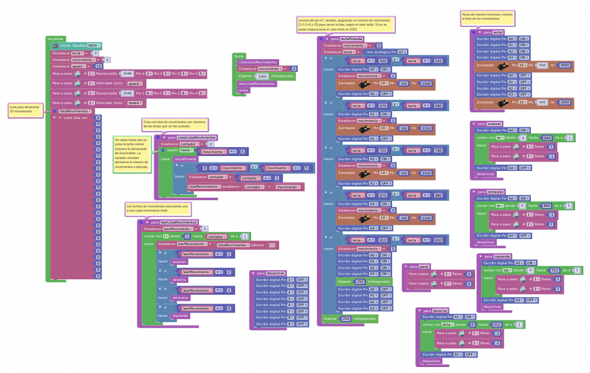

#**Funciones de movimiento**

En el programa de control para tener un orden del código se va a crear previamente **funciones de movimientos** que se llaman cuando corresponda al movimiento.

Funciones de Movimientos

#**Programa de control**

Con la información de las conexiones del teclado y los motores paso a paso se puede desarrollar el programa de control.

En el siguiente link se ha desarrollado un primer programa que se está testeando para comprobar su funcionamiento.

http://www.arduinoblocks.com/web/project/1217118

Programa de control

